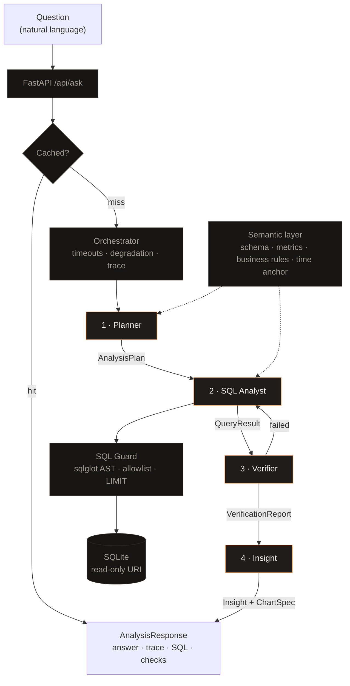

# QuickBite Agentic Analytics

Natural-language business analytics over a QSR sales dataset, answered by four
cooperating agents that plan the analysis, write and execute SQL, verify the
numbers arithmetically, and explain what the result means.

[](https://github.com/anilgehlotn/quickbite-agentic-analytics/actions/workflows/ci.yml)

- **Live application:** _(add the Vercel URL here)_
- **API:** _(add the Render URL here)_ — try `/api/health` and `/api/verify`
- **Demo video:** _(add the link here)_

---

## What it does

You ask a question in plain English. A planner interprets it and decides what
to measure, a SQL analyst writes and runs the queries against a SQLite star
schema, a verifier checks the returned numbers against each other before anyone
sees them, and an insight agent explains what happened and what to do about it.

Every answer ships with its evidence: the exact SQL that ran, the verification
checks that passed or failed, the duration and token cost of each agent, and
the plan the system worked from. The interface puts that trace beside the
answer rather than behind a link, because a claim that four agents collaborated
is worth nothing without the record.

The dataset is a fixed historical extract covering 1 August 2025 to 31 July
2026: 20,000 orders across 50 stores, 8 cities and 4 sales channels.

---

## Architecture



The two dotted edges matter as much as the solid ones. The planner and the SQL
analyst read the **same** semantic layer, so they cannot develop different
ideas about what a column means. And every query the analyst writes passes
through the **SQL guard** before it reaches the database — the analyst has no
path to SQLite that skips it.

The edge from the verifier back to the analyst is the self-healing retry: when
an arithmetic check fails, the failing sub-queries are re-run once with the
verifier's own message appended to the prompt, then verified again.

---

## The agents

| Agent | Role | Produces |
|---|---|---|
| **Planner** | Interprets the question, resolves relative dates against the fixed anchor, classifies intent, and decomposes the work into sub-queries. Rejects questions the data cannot answer instead of inventing a plan. | `AnalysisPlan` — intent, time window, metrics, sub-queries, reasoning, confidence |
| **SQL Analyst** | Writes one SQLite statement per sub-query, validates it through the guard, executes it, and repairs it once from the database's own error message. Sub-queries run concurrently. | `QueryResult[]` — exact SQL, columns, rows, timing, attempt count |
| **Verifier** | Runs 12–14 deterministic arithmetic checks in pure Python, then escalates to a model only for genuine ambiguity. A model can add a warning; it can never decide the verdict. | `VerificationReport` — status and every individual check |
| **Insight** | Explains the result as a senior analyst would: decomposes changes into volume and basket size, separates level from trend, distinguishes deterioration from reversion, and states caveats unprompted. | `Insight` + `ChartSpec` — headline, narrative, findings, caveats, actions |

The **Orchestrator** owns everything the agents do not: per-agent timeouts,
partial-failure handling, the self-healing retry, and the guarantee that the
pipeline never raises. Every path out of it returns a valid response with a
complete trace, including the failures.

---

## Key design decisions

### Deterministic verification runs before model verification

Asking a model whether its own pipeline produced a good answer is weak
evidence: it is the same class of system that produced the answer, it has no
independent access to the data, and it is agreeable by construction. Asserting
that a channel breakdown sums to its total, that AOV equals revenue over
orders, or that no revenue figure exceeds the annual total of the entire
dataset is strong evidence — it either holds or it does not, and when it fails
the failure names the number that is wrong.

So the arithmetic runs first, in code. If any error-severity check fails, the
model is never consulted. When it is consulted, its verdict is hardcoded to
warning severity: it can add a caveat, never overturn a sum. A test asserts the
mock was not called after a deterministic failure, because an untested claim
about ordering is just a comment.

### Qualifying sets are computed in SQL, not inferred by the model

"Which stores declined every month?" was answered wrongly, repeatedly, while
every individual number in the answer was correct. Handed 150 rows of monthly
revenue, the model would enumerate three stores whose figures declined
monotonically and then conclude that none had.

The fix was structural rather than another instruction: the plan now contains a
sub-query that returns one row per store with the monthly values pivoted into
columns, a computed `is_strictly_declining` flag and the endpoint change. The
model reads a flag instead of comparing numbers across rows. The same applies
to the prior-period baseline, which is emitted as
`window_revenue, baseline_revenue, delta_abs, delta_pct, is_above_baseline` on
the same row — because a store can be declining every month and still be above
its own historical run rate, and naming that store as the top concern is
arithmetically correct and analytically wrong.

Where a comparison is still at risk of being misread, the insight layer is
handed the grouping precomputed in Python rather than the rows to derive it
from. The principle throughout: **never ask the model to derive a comparison it
could read.**

### The data anchor is fixed, not taken from the clock

The dataset ends on 31 July 2026. The system's notion of "today" is the
constant `DATA_ASOF_DATE = 2026-07-31`, and every relative expression resolves
against it. Reading the clock instead would place "last 3 months" outside the
data and return zero rows for every time-bounded question — the most damaging
possible failure, because empty results look like findings. The anchor lives in
`config.py`, is injected into every agent prompt, and the SQL rules forbid
`DATE('now')` and `CURRENT_DATE` explicitly.

### Order grain is canonical for revenue

The source workbook has a reconciliation defect: line-level values do not sum
exactly to their order headers. Across the full year the gap is about 0.1% of
revenue, but the affected orders are concentrated in the most recent months, so
inside the three-month evaluation window it widens to about **0.44%** — which
makes it matter most for exactly the questions people ask most.

`fact_orders` is therefore canonical for revenue, order counts and AOV.
`fact_order_lines` is used only for SKU, product, category and margin
questions, where line identity is the only place the information exists. The
quality gate reports the variance with a per-month breakdown and escalates from
warning to error past a threshold, so the defect is quantified and bounded
rather than hidden.

### Why a semantic layer exists

Without one, every agent invents its own vocabulary and the failures are
plausible rather than obvious: a query that uses `net_revenue` instead of
`net_before_tax` overstates revenue by exactly the tax rate and looks
completely normal. The semantic layer is a single rendered description of the
tables, the ten canonical metrics with their SQL, ten business rules and the
time anchor, and it is generated from one structured specification so the full
and compact renderings cannot drift apart. Both the planner and the analyst
read it; the guard's table allowlist is derived from the same source.

### Why provider failover and answer caching exist

This is a public URL in front of paid APIs, opened by people the author will
never meet, possibly after the keys have expired. Both mechanisms exist for
that reality rather than for elegance.

Failover tries each configured provider in order, retrying transient failures
(429, 5xx, timeouts) within a provider and moving on immediately for permanent
ones (401, 400, 403, 404). When a live run exhausted all four, it produced one
structured error naming all four reasons instead of a traceback — and exposed
two stale model IDs of mine in the process.

The cache is not a latency optimisation. The eight evaluation questions are
warmed by `scripts/warm_cache.py` and the resulting file is committed, so those
answers are served from disk with **no provider involved at all**, complete
with their original traces. `scripts/check_offline.py` proves it in CI by
clearing every key and asserting all eight still return a headline, narrative,
executed SQL, verification report and four-agent trace.

---

## Data model

A star schema built from the workbook by `app/etl/build_db.py`:

| Table | Rows | Notes |
|---|---|---|
| `dim_store` | 50 | City, region, format; all active |
| `dim_product` | 30 | Category, veg flag, price, cost |
| `dim_customer` | 5,000 | Segment; **5,664 of 20,000 orders (28%) have no customer** |
| `dim_promotion` | 6 | **Only 840 orders (4%) carry a promotion** |
| `dim_calendar` | 365 | Day type, festive period, month key |
| `fact_orders` | 20,000 | **Canonical grain for revenue, orders and AOV** |
| `fact_order_lines` | 49,834 | Line grain; SKU, quantity, margin |
| `mart_store_month` | 600 | 50 stores × 12 months, pre-aggregated |
| `mart_city_month` | 96 | 8 cities × 12 months |
| `mart_channel_month` | 48 | 4 channels × 12 months |

Calendar attributes (`month_key`, `day_type`, `festive_period`, `is_weekend`)
are denormalised onto `fact_orders`, so weekend, festive and monthly analysis
needs no join. Dimensions are always LEFT JOINed: an inner join to
`dim_customer` silently drops more than a quarter of all revenue and the result
still looks plausible.

Revenue means `net_before_tax` throughout. `net_revenue` includes the 5% tax
and overstates revenue by exactly that much.

The database is committed to the repository. It deploys with no infrastructure
to provision and no build step on the host.

---

## Testing

**692 tests**, all passing without any API key.

### Ground truth is computed independently

`scripts/compute_golden_answers.py` answers the eight evaluation questions with
pandas, reading the **original Excel workbook** — not the SQLite database. That
independence is the point: if the ground truth and the agents both read the
same SQL layer, a bug in that layer is invisible to both. The two paths share
only `config.py`.

`tests/test_golden.py` then cross-checks them, asserting that the pandas
figures and equivalent SQL queries agree to within 1 INR across all 50 stores,
4 channels, 24 city-months, 12 months and both marts.

### The end-to-end suite

`tests/test_golden_e2e.py` runs the real orchestrator over the real database
for all eight questions and asserts against ground truth: exact top-five and
bottom-five store IDs in rank order, all four channels with matching revenue,
the top SKUs by both quantity and revenue, the nine consistently declining
stores, and the four-versus-five split between stores above and below their own
baseline.

Two assertions are hallucination tests rather than correctness tests: question
five must report plainly that **no** city declined monotonically (the
temptation is to name one anyway), and question eight must not lead its
recommendations with the steepest decliner, because that store is above its own
prior quarter. A universal check asserts that no figure appears in any
narrative that is absent from the query results.

### Replay and live mode

By default the suite runs in **replay** mode: the model is replaced by a fake
that returns the plan, SQL and narrative the live system actually produced,
taken from the warmed cache. Everything downstream is real — the guard
validates, SQLite executes, the verifier checks, and the assertions compare to
ground truth. No network, no cost, and the fixtures cannot drift from reality
because they *are* what the system did.

Setting `QUICKBITE_E2E_LIVE=1` calls the configured provider instead. Replay
mode's honest limitation is that it never asks a model anything, so it cannot
catch a prompt regression; it catches regressions in everything else, which is
the part that must never break silently.

---

## Running locally

Requires Python 3.11+ and Node 20+.

```bash
# Backend
cd backend
python -m venv .venv && source .venv/bin/activate
pip install -r requirements.txt
python -m app.etl.build_db          # builds data/quickbite.db from the workbook
python -m app.etl.quality_checks    # 36 checks; exits non-zero on error
uvicorn app.main:app --reload       # http://localhost:8000
```

```bash
# Frontend, in a second terminal
cd frontend
npm install
echo "NEXT_PUBLIC_API_URL=http://localhost:8000" > .env.local
npm run dev                         # http://localhost:3000
```

Open http://localhost:3000 and click any suggested question. **No API key is
required for those eight** — they are served from the committed cache. To ask
new questions, copy `backend/.env.example` to `backend/.env` and add at least
one provider key.

Useful commands:

```bash
python -m pytest tests/ -q          # the full suite
python scripts/check_offline.py     # proves the cache answers with no keys
python scripts/warm_cache.py        # re-warms the cache (needs a key)
python scripts/keepalive.py --url https://your-service.onrender.com
```

---

## Security

Agent-generated SQL reaching a database is the obvious risk in a system like
this, and prompt injection through a public input is a real threat rather than
a theoretical one. Six layers stand between the model and the data:

1. **Parse-based validation with sqlglot, never regex.** Regex on SQL loses to
   comments, string literals and whitespace tricks. `DROP/**/TABLE/**/x` is
   caught because the AST node is a `Drop`, and a query containing the string
   `'DROP TABLE'` in a WHERE clause is correctly *allowed*.
2. **Exactly one statement.** Stacking behind a comment fails on the statement
   count, not on pattern matching.
3. **Reads only.** `exp.Query` is the discriminator; anything else is refused.
4. **Table allowlist**, derived from the semantic layer, with CTE names
   subtracted so `WITH` queries validate correctly, and `sqlite_%` internals
   blocked.
5. **Injected row cap and a query deadline** enforced by a progress handler.
6. **Read-only connection.** `file:path?mode=ro` — SQLite itself refuses the
   write, so the last layer holds even if the five above have a bug.

Also: per-IP rate limiting (10/minute, 200/day) with cached answers exempt
because they cost nothing; a global exception handler that returns a structured
error with a request id and never a traceback; and API keys read from the
environment only, never logged, never returned by `/api/health` — which reports
which providers are *configured*, not what their keys are. `.env` is
gitignored; `.env.example` carries no values.

---

## Known limitations, and what I would do next

**The line-to-header reconciliation variance.** Around 0.44% of revenue does
not reconcile between the two grains inside the three-month evaluation window,
against 0.1% across the full year. Product-level answers use line grain and
will not sum exactly to the canonical totals. It is measured, bounded by the
quality gate and stated in the affected answers, but it is a defect in the
source data that no amount of care in the query layer removes.

**Only one provider is funded.** The Anthropic and OpenAI keys are out of
credit and the xAI team has none, so Gemini is doing all the work — currently
`gemini-flash-lite-latest`, chosen over the stronger `gemini-flash-latest`
because the latter's free tier allows 20 requests per day, which one afternoon
of testing exhausts. A stronger model would improve answer quality
measurably; every model ID is environment-overridable precisely so that is a
dashboard change, not a redeploy.

**The live trace advances on a schedule, not a measurement.** While a request
is in flight the frontend highlights each stage on an elapsed-time schedule,
because the backend returns one response rather than streaming events. The UI
says so, in-flight steps show no duration or token count, and every figure
after the response lands is real. Server-sent events would make it truthful
rather than merely honest, and that is the change I would make first.

**Answer quality is model-dependent and varies between runs.** The cached eight
are verified correct against ground truth. New questions are not guaranteed to
be: the same question asked twice can produce different decompositions, and
quality degrades noticeably when the plan does not isolate a membership test
into its own sub-query. Most of the work in the later modules was converting
such failures from prompt instructions into computed columns, and more of that
remains — the pattern generalises further than I have taken it.

**A caveat about the caveats.** The insight agent's numeric traceability check
skips percentages and values below 100, because a growth rate is arithmetic the
writer is entitled to do. A fabricated small figure or an invented percentage
would pass it. Widening the check without producing false positives needs a
better idea than the one I have.

**Not built:** conversational follow-up (each question is independent),
authentication, and any write path. The rate limiter is in-memory and resets on
restart, which is adequate for a cost guard and inadequate as a security
control.
