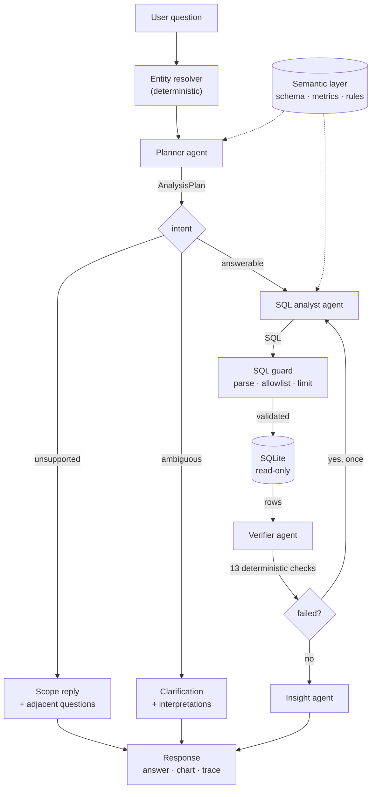

# Agent Architecture

QuickBite Agentic Analytics

Repository: https://github.com/anilgehlotn/quickbite-agentic-analytics

---

## 1. Overview

QuickBite Agentic Analytics answers natural-language questions about a
quick-service restaurant chain's sales data. A user types "which stores are
declining and why"; the system plans an analysis, writes and executes SQL,
checks the resulting numbers arithmetically, and explains what they mean — and
shows every one of those steps, including the exact SQL, in a trace beside the
answer.

The problem it solves is narrower than "natural language to SQL". Producing a
query that runs is easy. Producing an answer that is *correct*, and being able
to demonstrate that it is correct, is the hard part. A query can execute
perfectly and return the wrong rows; a summary can quote accurate figures and
draw a conclusion they do not support. Both failures look exactly like success.

One principle governs every design decision in this system:

> **The model decides what to compute. Deterministic code decides how it
> executes, and checks the result.**

Concretely, agents emit structured artefacts — a plan conforming to a Pydantic
schema, a SQL string, a JSON insight object. They never perform arithmetic,
never format a number, never decide whether a value is plausible, and never
determine which rows satisfy a condition. Everything a language model is
unreliable at is done in Python or SQL; everything it is good at — interpreting
intent, choosing an approach, writing prose — is left to it.

This principle is not stated once and forgotten. Sections 6 and 10 describe
specific defects that occurred when it was violated, and the structural changes
made in response.

**Stack.** Python 3.12, FastAPI, Pydantic v2, SQLite, sqlglot for SQL parsing.
Next.js 14 with TypeScript and Tailwind for the frontend. Four LLM providers
behind one client. No agent framework — see section 10 for why.

---

## 2. Agent architecture

### Diagram



### Text fallback

```
  User question
        |
        v
  Entity resolver  (deterministic; resolves "ST7" -> ST007, "Bangalore" -> Bengaluru)
        |
        v
  Planner agent  <....... Semantic layer (schema, 10 metrics, 10 business rules)
        |
        | AnalysisPlan
        v
     [ intent? ] --- unsupported --> Scope reply + adjacent answerable questions --.
        |          --- ambiguous  --> Clarifying question + interpretations -------|
        | answerable                                                              |
        v                                                                         |
  SQL analyst agent  <.... Semantic layer                                         |
        |                                                                         |
        | SQL                                                                     |
        v                                                                         |
  SQL guard   (single statement, query-type node, table allowlist, LIMIT)         |
        |                                                                         |
        v                                                                         |
  SQLite, read-only connection  ---- rows ---->  Verifier agent                   |
                                                      |                           |
                                        13 deterministic checks                   |
                                                      |                           |
                                          failed? --yes, once--> back to analyst  |
                                                      |                           |
                                                      no                          |
                                                      v                           |
                                              Insight agent                       |
                                                      |                           |
                                                      v                           v
                                      Response: answer, chart, verification, trace
```

The semantic layer and the entity resolver are inputs to the agents, not stages
in the pipeline. The SQL guard sits between the analyst and the database and
cannot be bypassed: the analyst has no other route to SQLite.

### The agents

| Agent | Role | Input | Output | On failure |
|---|---|---|---|---|
| **Planner** | Interpret the question; decide what to measure, over what window, broken into which sub-queries | Question text, resolved entities, semantic layer | `AnalysisPlan` (intent, time window, metrics, dimensions, sub-queries, reasoning, confidence) | No deterministic substitute exists. The run stops and returns the unavailable message with the cached questions offered. One retry first, with the schema validation error appended. |
| **SQL analyst** | Write and execute one SQL query per sub-query | `SubQuery` + `AnalysisPlan` + semantic layer | `QueryResult` (SQL, columns, rows, row count, timing, attempts) | Two attempts, the second carrying the guard's or the database's own error message. If the *provider* is unreachable, SQL is assembled deterministically from the plan and the result is flagged `degraded`. If the provider is reachable but its SQL is rejected, the result carries the error — see section 10. |
| **Verifier** | Check the numbers against each other and against the plan | `AnalysisPlan` + all `QueryResult`s | `VerificationReport` (status, checks, summary) | Every check is deterministic Python; a provider outage costs nothing. The optional model escalation reports that it could not run rather than being hidden. |
| **Insight** | Explain what the result means, in business language | `AnalysisPlan` + verified results | `Insight` (headline, narrative, key findings, caveats, actions, confidence) + `ChartSpec` | Falls back to deterministic prose generated from the rows, at reduced confidence, and the trace says the explanation layer was unavailable. |

Every agent inherits from a common base that owns timing, structured logging,
error capture, and production of the `AgentStep` that appears in the trace. A
subclass implements only `execute` and `summarize`. That split is deliberate:
if producing a trace step were each agent's own responsibility, the one agent
that forgot would be invisible in the UI, and a failing agent would be
invisible exactly when the trace is most useful.

---

## 3. Orchestration

The orchestrator sequences the agents and owns every degradation decision. The
agents themselves are deliberately narrow — the planner does not know the
analyst can fail, the analyst does not know what the verifier will make of its
rows — so the policy lives in one readable file rather than scattered across
four.

**Sequence.**

1. **Plan.** One planner call, under a 45-second timeout.
2. **Branch on intent.** `unsupported` returns a scope reply; `ambiguous`
   returns a clarifying question. Neither runs any SQL.
3. **Execute.** All sub-queries run **concurrently** via `asyncio.gather`,
   under a 90-second timeout for the batch. They are independent by
   construction, so on a diagnostic question with five sub-queries this is the
   difference between five sequential model round trips and roughly one.
4. **Verify**, under a 45-second timeout.
5. **Self-heal, at most once.** If verification fails on an error-severity
   check, only the sub-queries the report blames are re-run, with the
   verifier's own message appended to the analyst's prompt, and the merged
   results are verified again. Exactly once: a model that cannot fix a stated
   arithmetic inconsistency on the second attempt will not fix it on the fifth,
   and a user is waiting. A repaired result never overwrites one that at least
   produced rows.
6. **Explain**, under a 90-second timeout.

**Retries, at three levels, for different failures.**

| Level | Count | Trigger |
|---|---|---|
| HTTP, within a provider | 2 retries, exponential backoff from 0.5 s | 429, 5xx, timeout, connection reset |
| Provider failover | Every configured provider in order | Any provider-level failure |
| Planner schema | 1 retry | Plan fails Pydantic validation |
| SQL | 2 attempts total | Guard rejection or execution error |
| Verification self-heal | 1 | Error-severity check failed |

**Degradation policy.** Each stage has a defined answer to "what if this
fails", and the tests in `tests/test_degraded.py` simulate a dead provider at
each stage independently.

- Planner fails → unavailable message; the eight cached questions are offered.
- Analyst fails on *some* sub-queries → answer proceeds on the rest, and the
  gap is visible in the trace and the results list.
- Analyst fails on *all* sub-queries → honest failure naming each reason.
- Verifier fails → the answer is still returned, marked unverified.
- Insight fails → deterministic prose from the rows, reduced confidence.

**The pipeline never raises.** Every path out of `Orchestrator.run` returns a
valid `AnalysisResponse`. `run` wraps `_run` in a catch-all that converts an
unexpected exception into a well-formed unanswered response with whatever trace
was accumulated. A caller renders one shape whether the run succeeded, partly
succeeded, timed out, or was refused; an exception can never reach a user as a
500.

**The trace is complete and honest.** Every stage contributes an `AgentStep`,
including skipped and failed ones. A skipped verifier appears as `SKIPPED` with
its reason, not as an absence. During a live run the frontend shows the
pipeline advancing, but those in-flight steps deliberately carry no duration
and no token count — the ordering is a schedule, not a measurement, and
inventing numbers in the one component whose job is to be trustworthy would be
self-defeating.

---

## 4. Data architecture

A star schema in SQLite, built from an Excel workbook by a deterministic ETL.

| Table | Rows | Purpose |
|---|---:|---|
| `fact_orders` | 20,000 | Order grain. Revenue, order counts, AOV, channel, hour, day type, festive flags |
| `fact_order_lines` | 49,834 | Line grain. SKU, quantity, line value, estimated COGS, line margin |
| `dim_store` | 50 | Store, city, region, format, price index |
| `dim_product` | 30 | SKU, category, veg/non-veg, base price, COGS percentage |
| `dim_customer` | 5,000 | Segment, home city, join date |
| `dim_promotion` | 6 | Promotion type, discount, applicability |
| `dim_calendar` | 365 | Day type, festive period, month key |
| `mart_store_month` | 600 | Pre-aggregated monthly store metrics |
| `mart_city_month` | 96 | Pre-aggregated monthly city metrics |
| `mart_channel_month` | 48 | Pre-aggregated monthly channel metrics |

The three marts exist because monthly trend, ranking and decline questions are
the most common shapes asked and the most expensive to compute repeatedly from
20,000 orders. They reconcile exactly with `fact_orders`, which the quality gate
asserts.

**Indexes.** Eleven explicit indexes: `fact_orders` on order date, store, channel,
month key, weekend flag and festive period; `fact_order_lines` on order id and
SKU; each mart on month key.

**Quality gate.** `python -m app.etl.quality_checks` runs 36 checks over the
built database — row counts, referential integrity, arithmetic reconciliation
between grains, null profiles, date ranges, and the documented distributional
properties. It currently reports **0 errors, 1 warning, 5 observations**. It
runs in CI on a database rebuilt from the workbook on every push, so an ETL that
stops reproducing the shipped data fails there rather than in a demo.

### Three data decisions that shape everything

**1. The data anchor is fixed, not read from the clock.** The dataset covers
2025-08-01 to 2026-07-31. "Today" is the constant `DATA_ASOF_DATE = 2026-07-31`
everywhere — in the planner's prompt, in the SQL rules, in the verifier's range
check, and in the frontend footer. Any query using `DATE('now')` returns zero
rows against this data, so the SQL rules forbid clock-reading functions
outright and the verifier independently asserts that every date in every result
falls inside the data range. Without this, "last 3 months" silently means
something different on every day the system is run, and a reviewer opening the
deployment months later would get empty answers with no visible cause.

**2. Revenue is tax-exclusive, and that is stated once.** `net_before_tax` is
canonical; `net_revenue` includes the 5% tax and overstates revenue by exactly
that. The semantic layer defines `revenue` as `SUM(net_before_tax)` and a
business rule states the distinction in the words an agent will encounter. Every
answer's caveats repeat it. The alternative — letting each query decide —
produces a set of answers that are each defensible and mutually inconsistent.

**3. Order grain is canonical for revenue.** The two grains do not reconcile
exactly: line-level revenue exceeds order-level by **0.110% across the full
year, but 0.445% within the May–July evaluation window** — the variance is
concentrated in exactly the period the evaluation questions ask about. A
revenue figure taken from `fact_order_lines` would therefore disagree with the
canonical answer by an amount large enough to notice and small enough to look
like a rounding artefact. So `fact_orders` is canonical for revenue, orders and
AOV; `fact_order_lines` is used only for SKU, category and margin questions,
where it is the only grain that has the data. This is a business rule in the
semantic layer, not a convention.

---

## 5. The semantic layer

`app/semantic/schema.py` is a single module rendering roughly 17,600 characters
of context that both the planner and the analyst receive. It contains:

- **The time anchor**, with "last 3 months" and similar phrases pre-resolved to
  absolute dates.
- **Every table and column**, with types and a one-line description of what the
  column actually means.
- **Ten canonical metric definitions**, each with its exact SQL expression, its
  source table and its unit — `revenue`, `revenue_with_tax`, `gross_revenue`,
  `discount`, `orders`, `units`, `aov`, `units_per_order`, `gross_margin`,
  `margin_pct`. A plan naming any other metric is rejected by a Pydantic
  validator before SQL is written.
- **Ten business rules** stating the traps in the words an agent will meet
  them: LEFT JOIN `dim_customer` because 28.32% of orders are anonymous
  walk-ins; LEFT JOIN `dim_promotion` because only 4.20% carry a promotion;
  revenue means `net_before_tax`; averages are ratios of sums, never `AVG()`
  over pre-aggregated rows.
- **Four few-shot query examples**, each executed against the real database by
  `tests/test_semantic.py`. Few-shot SQL referencing a column that does not
  exist teaches an agent to hallucinate the same column, so the examples are
  verified rather than trusted.

**Why it exists.** Given a raw schema, a competent model writes SQL that is
*plausible*. It will use `AVG(net_revenue)` for average order value, which is
wrong twice over — the tax and the average-of-averages. It will INNER JOIN the
customer dimension and silently drop 5,664 orders. Neither error produces an
exception; both produce a confident number that is wrong by an amount nobody
notices. The semantic layer is what converts plausible SQL into correct SQL, and
it is the single highest-leverage component in the system.

### Entity resolution

`app/semantic/entities.py` resolves what a question *names* to what the database
*stores*, deterministically and before the planner sees the question. It loads
211 distinct values across 16 dimensions at startup, then matches in decreasing
order of certainty: exact, alias, identifier normalisation, word-boundary
substring, and finally fuzzy matching at a 0.84 difflib threshold restricted to
single tokens of five characters or more.

It handles `ST7` → `ST007`, `Bangalore` → `Bengaluru` (17 city aliases),
`Bengalru` → `Bengaluru`, `veg burgers` → the three Veg Burger SKUs, and
`delivery` → Swiggy and Zomato together. The canonical values and the columns
they live in are injected into the planner prompt as facts.

Three properties matter more than recall, and each is tested:

- **It never invents.** `ST999` resolves to nothing, not to the nearest store.
- **It never widens.** `veg burger` is a substring of `Non-Veg Burger 2`;
  matching on a plain substring would answer a question about veg burgers with
  non-veg data, so matches must begin at a word boundary.
- **Ambiguity survives.** A phrase matching several *kinds* of entity —
  `pizzas` matches both the Pizza category and several product names — is
  reported as ambiguous rather than decided, which is what drives the
  clarification path.

---

## 6. Verification

Thirteen deterministic checks run on every request, in Python, before any model
is consulted:

| Check | Catches |
|---|---|
| `all_sub_queries_executed` | A planned sub-query that never ran |
| `results_non_empty` | A query that returned nothing |
| `no_all_null_columns` | A column that is null in every row |
| `no_negative_measures` | Negative revenue, order counts or quantities |
| `aov_reconciles` | AOV that is not revenue ÷ orders, within 0.5 INR |
| `parts_sum_to_total` | A breakdown that does not sum to its own stated total, within 1 INR |
| `shares_sum_to_100` | Percentage columns not summing to 100, within 1 point |
| `revenue_within_plausible_bound` | A figure above the configured plausibility ceiling |
| `row_count_matches_expectation` | "Top 5" returning four rows or six |
| `sql_references_planned_metrics` | Executed SQL that does not mention the metrics the plan named |
| `dates_within_data_range` | Any date outside 2025-08-01 to 2026-07-31 |
| `results_cover_the_window` | A window silently truncated — see below |
| `dimension_coverage` | A breakdown missing members of its own dimension — see below |

A model escalation (`llm_plausibility`) is consulted **only** when no
error-severity check has failed and something remains genuinely ambiguous. Its
verdict is capped at warning severity: it can raise a concern, never overturn
arithmetic.

**Why deterministic checks come first.** Arithmetic is strong evidence and a
model grading its own pipeline is weak evidence. Running the model first, or
letting it adjudicate a failed sum, means it can sometimes talk the pipeline out
of a real defect — the exact failure this ordering prevents. Verification that
depends on a provider also disappears when the provider does; these checks cost
nothing and work in a total outage.

### Two checks written in response to specific defects

Both caught errors in which **every individual figure was correct**, which is
precisely the class of error no amount of number-checking finds.

**`results_cover_the_window`.** A query filtered `month_key BETWEEN
'2026-05-01' AND '2026-07-31'`. `month_key` is a `'YYYY-MM'` string, and
`'2026-05'` sorts before `'2026-05-01'`, so every May row was silently dropped.
The remaining June and July figures were individually correct, the totals were
internally consistent, and the answer described a two-month window as three. The
check now asserts that a result claiming to cover a window contains every month
in it. A SQL rule was added alongside it stating that `month_key` is not a date.

**`dimension_coverage`.** A "by city" question returned one city. Nothing was
arithmetically wrong; the answer simply described a fraction of the population
as though it were the whole. The check compares distinct values returned against
the dimension's known cardinality and flags a shortfall.

---

## 7. Reliability

The deployed URL may be opened months after the keys configured for it expired.
Reliability here is therefore a correctness requirement, not an optimisation.

**Multi-provider failover.** Four providers — Anthropic, OpenAI, Gemini, xAI —
behind one client, called in configured order. Each provider's HTTP API is
called directly through `httpx` rather than through a vendor SDK; four SDKs
would mean four dependency trees and four sets of abstractions to read past,
while the raw request and response shapes are short enough to read in one
sitting. Transient failures (429, 5xx, timeout) retry within the provider;
permanent ones (401, 400) fail over immediately, because retrying a rejected key
only wastes the seconds a user is waiting.

**Circuit breaker.** After 2 consecutive failures a provider is skipped for a
120-second cooldown, then tried again. Without this, every request pays the full
timeout of a provider whose key expired months ago. Two rather than one, because
a single failure is often the request's fault rather than the provider's. When
the breaker has taken *everything* out of rotation it is bypassed and the
providers are tried anyway: an open breaker is a prediction that a call will
fail, and a prediction is not a good enough reason to return nothing.

**Startup liveness probe.** One minimal call per provider at startup, run as a
background task so a slow provider cannot delay the port opening. Providers that
answer are ordered ahead of those that did not, and a failed probe opens the
breaker immediately — the probe *is* the evidence, and making the first user
request rediscover it defeats the point. On the current deployment this
correctly identified in about four seconds that three of four providers had no
credit remaining.

**A malformed JSON response fails over to a different provider.** Malformed
structure is a property of the model, not of the moment: at temperature zero the
same model given the same prompt usually produces the same broken output, so
retrying it burns a user's time to arrive back where it started. Each provider
gets exactly one attempt per JSON call.

**Answer caching.** Answers are cached by normalised question text and the cache
file is committed to the repository. The consequence is the property this system
is built around:

> All eight evaluation questions answer completely — headline, narrative,
> executed SQL, verification report and four-agent trace — with **no LLM
> provider configured at all**.

This is asserted by `scripts/check_offline.py`, which clears every provider key
before importing the application, and which **runs in CI on every push**. It is
a property enforced by a script rather than a claim made in a document.

**Provider health is exposed.** `GET /api/providers` reports which providers are
configured, which are healthy, which are in cooldown and for how long, and each
one's last probe result. `POST /api/providers/probe` re-probes on demand, so a
provider whose key was fixed can be brought back without a redeploy. No
credential material appears in either payload, not even a masked prefix.

---

## 8. Security

The system is publicly deployed and a language model writes its queries, so any
text a user types reaches a SQL generator. Prompt injection is an expected
input, not a hypothetical one.

**Validation is parse-based, never pattern-based.** Regex over SQL loses to
comments, string literals, nested quoting and whitespace. Every check inspects
the sqlglot AST. The difference is not theoretical:

- `SELECT store_name FROM dim_store WHERE store_name LIKE '%DROP TABLE%' LIMIT 5`
  is **accepted**. It contains the word `DROP` inside a string literal, which a
  keyword blocklist would reject and a parser correctly sees as a `SELECT` over
  an allowlisted table.
- `SELECT 1 -- ' \n; DROP TABLE dim_store` is **rejected**. It defeats a naive
  pattern by hiding the second statement behind a comment, but the parser sees
  two statements and the first layer refuses anything that is not exactly one.

**Six layers, none load-bearing on its own.**

1. The SQL must parse as exactly one SQLite statement.
2. That statement must be a query node (`SELECT` or a set operation), checked on
   the parsed node class, so `DROP` cannot be disguised.
3. Every table read must be on the semantic layer's ten-table allowlist, with
   CTEs defined in the same query resolved first so they are not mistaken for
   unknown tables.
4. No `sqlite_*` internal table may be touched.
5. A `LIMIT` is required, and injected when missing; results are capped at 1,000
   rows and queries at 10 seconds.
6. Execution happens over a **read-only URI connection** (`file:...?mode=ro`).

Layer 6 is the one that matters most. Layers 1–5 are software and can have bugs;
a connection opened `mode=ro` is enforced by SQLite itself. `tests/test_sql_guard.py`
contains 75 tests, including injection attempts through the question text.

**Rate limiting.** A per-IP sliding window, 10 new analyses per minute and 200
per day. Cached answers are exempt: they cost nothing to serve, and rate-limiting
them would punish exactly the interaction the system wants a reviewer to have.

**Key handling.** Keys are read from the environment, never logged, and never
returned by any endpoint — health output reports which providers are
*configured*, never their credentials. `tests/test_llm.py` and
`tests/test_resilience.py` assert that no key-shaped string appears in a health
payload, using deliberately key-shaped fixtures.

---

## 9. Testing

**809 tests**, all passing with no API keys configured.

| Area | Tests | Area | Tests |
|---|---:|---|---:|
| Contracts | 101 | Analyst | 37 |
| Semantic layer | 95 | Insight | 35 |
| SQL guard | 75 | API | 32 |
| Golden answers | 67 | Verifier | 29 |
| Entity resolution | 52 | Resilience | 29 |
| ETL | 50 | Config | 25 |
| Golden end-to-end | 50 | Quality gate | 24 |
| LLM client | 37 | Planner | 21 |
| Frontend contract | 18 | Degraded paths | 16 |
| Orchestrator | 16 | | |

**Ground truth is computed independently.** The eight evaluation answers are
computed from the Excel workbook with pandas and stored in
`tests/golden_answers.json`. The application answers from the SQLite star
schema. `tests/test_golden.py` runs the SQL equivalent of five of those
questions and asserts it lands within 1 INR of the pandas figure. Two
independent implementations agreeing across twelve months of data is real
evidence the ETL is faithful; either one alone proves nothing. The same file
also checks internal consistency, so a mistake in any single answer surfaces as
a contradiction rather than a plausible number.

**The end-to-end suite** (`tests/test_golden_e2e.py`, 39 assertions across 50
tests) drives the full pipeline and asserts, per question, the specific facts
that matter — that Q5 states plainly that *no* city declined every month, that
Q8 names exactly nine stores and separates the four above their own baseline
from the five genuinely below it, that no store identifier is malformed. It also
applies universal checks to every question: answered, verification not failed,
all four agents present in the trace, and no figure in the narrative that does
not appear in the query results.

**Replay versus live.** By default the suite replays the plan, SQL and narrative
that the live system actually produced, then runs them through the real guard,
the real SQLite database and the real verifier. So CI validates the data path —
the part that must never break silently — without a network call or a cent of
spend. Setting `QUICKBITE_E2E_LIVE=1` runs the same assertions against live
providers.

The honest limitation of replay is that **it cannot catch a prompt regression**.
If a prompt change causes the planner to produce a worse plan, replay will not
notice, because it replays the old plan. Replay proves the data path is intact;
only a live run proves the prompts still work. Both exist for that reason.

**Environment pinning.** The suite had no `conftest.py`, so it inherited
whatever provider keys the developer happened to have in a gitignored `.env`.
Twelve API tests silently depended on that: they POST to `/api/ask`, which
short-circuits at the provider guard when nothing is configured, so the stubbed
orchestrator was never reached. They passed locally and failed in CI — the same
suite exercising different code paths in two environments. `tests/conftest.py`
now pins the environment before `app.config` is imported: one obviously-fake
provider key, the other three blank, and the startup probe disabled so no test
can make a network call.

**Frontend contract tests.** The TypeScript types in `frontend/lib/types.ts`
are hand-maintained mirrors of the Pydantic contracts, and nothing at runtime
checks them — a field added on one side and forgotten on the other compiles
cleanly and reads `undefined` in the client. `tests/test_frontend_contract.py`
compares all fifteen wire contracts field by field, plus both string-union
enums. It was written after exactly that drift occurred.

---

## 10. Engineering decisions

### Why a custom orchestrator rather than a framework

LangChain or LlamaIndex would have supplied the agent loop. They would also have
supplied their own retry semantics, their own error types, their own prompt
templates and their own opinions about memory — and the whole argument of this
system is that the *specific* degradation behaviour is the product. The
self-healing retry that re-runs only the sub-queries a verification report
blames, the distinction between a provider being unreachable and a model writing
bad SQL, the trace that shows skipped steps rather than hiding them: each of
these is a decision I wanted to make explicitly and be able to point at. The
orchestrator is about 870 lines and every branch in it is deliberate. A
framework would have made the first day faster and every subsequent day slower.

### Why deterministic verification precedes model verification

Because arithmetic is strong evidence and a model reviewing its own pipeline is
weak evidence. If the model runs first, or is allowed to adjudicate a failed
check, it will sometimes talk the system out of a real defect. The escalation
therefore runs only when nothing arithmetic has failed, and its verdict is
hardcoded to warning severity. There is also a reliability argument: checks that
depend on a provider vanish when the provider does, and these do not.

### Why qualifying sets and comparisons are computed in SQL

This is the decision that most improved answer quality, and it was established
by three separate defects.

**Defect 1 — a misclassified store.** Asked which stores were consistently
declining and why, the system named a store as the top concern that was, in
fact, still above its own prior-quarter baseline. Every figure quoted was
correct; the store had fallen from an unusually strong quarter and was
reverting, not deteriorating. The model had been given two result sets and asked
to compare them by reading. The fix was structural: the baseline sub-query now
returns one row per entity with `window_revenue`, `baseline_revenue`,
`delta_abs`, `delta_pct` and `is_above_baseline` already computed as columns.
The baseline is a **column, never a filter** — making it a filter causes the
reverting entities to vanish from a question that asked about all of them.

**Defect 2 — a headline contradicting its own findings.** The answer to "are any
cities declining" led with a city named as declining, while its own key findings
listed the monthly figures showing that city rising in the middle month. The
model had been handed 8 cities × 3 months and asked to spot a monotonic pattern
by eye. The fix: one sub-query computes the qualifying set in SQL with window
functions and emits a boolean column; the monthly series remains a separate
sub-query so the answer can still show the shape of each decline.

**Defect 3 — an evasive answer.** After a related change, the same question
produced "several of these locations", naming none. The correct answer was that
*no* city qualified — and an empty set is a perfectly good answer, but only if
the system computes the set rather than inferring it. A yes/no question needs the
set just as much as a "which" question does.

The general rule this established: **never ask the model to derive a comparison
it could read.** Fifty stores across three months is a hundred and fifty numbers,
and a reader comparing them by eye will miss some. Compute the membership test in
SQL, emit a boolean column, pre-group it in Python for the prompt.

### Why instruction scoping lives in code, not in prompt conditions

The baseline-columns instruction above was first added as a conditional sentence
in the shared analyst prompt: *"when this sub-query is the baseline comparison,
return one row per entity…"*. It contaminated unrelated sub-queries. Two
questions' monthly-trend queries became copies of the baseline query, collapsing
a three-month series into two period totals — destroying exactly the thing a
trend question asks about — and both answers then concluded nothing had
declined.

Prose scoping does not reliably scope. The fix moved classification into Python:
functions that inspect a sub-query's id and purpose and decide which instruction
block it receives, checked in a defined order because the qualifying query for
"declined every consecutive month" contains the words "consecutive" and "month"
and would otherwise be classified as a trend query. Scoping an instruction is a
control-flow decision, and control flow belongs in code.

### Why schema examples are stripped from the injected response schema

The insight agent is given `Insight.model_json_schema()` so it knows what shape
to return. That schema embeds the model's `json_schema_extra` example — and the
example contained real findings from this dataset, written when the contract was
authored. A live run reproduced "48,860 INR" and "ST039 fell 41.4%" verbatim in
an answer to a question that had never queried city data. The model was not
hallucinating; it was copying an example it had been handed and told was the
correct shape.

`schema_without_examples()` now strips every `examples` and `json_schema_extra`
key from the schema before injection. The general lesson: anything placed in a
prompt is training data for that call, including the parts intended only as
formatting guidance.

### Why the accent colour avoids the hues that already carry meaning

The interface uses one accent colour. It was originally a deep pine green, which
looked correct until the in-flight trace was examined: the running step's dot was
nearly indistinguishable from the completed steps' dots, because "verified" and
"succeeded" are also green. Worse, chart bars in accent green read as *good*
rather than as *data* — a semantic claim the chart was not making.

Green, amber and red are spoken for by verification status. The accent moved to a
deep aubergine, which collides with nothing, carries white text at 12:1 contrast,
and lets a bar chart be neutral. Colour in this interface is a channel that
already carries meaning, so the accent had to be chosen from what was left rather
than from what looked nice.

### Why answers are cached and committed

A reviewer may open the deployed URL long after the API keys have expired, and a
system that cannot answer its own evaluation questions at that moment has failed
regardless of how well it is built. The cache makes the eight questions a
property of the repository rather than of a live credential. Serving is
cache-first, so those answers are also instant, which is the right behaviour for
the interaction a reviewer is most likely to have. The cost is that a cached
answer is a frozen snapshot: the committed reports were computed when each answer
was warmed, so six of the eight show twelve verification checks rather than the
thirteen the current code runs.

---

## 11. Known limitations, and what I would do next

Stated plainly, because a reviewer should finish this section believing the
author understands the system's weaknesses.

**Narrative referential slips pass verification.** Asked to compare two stores,
one live answer said "ST015 outperformed ST015" where the second should have been
ST007. Every *number* was correct, so all thirteen checks passed. The verifier
checks arithmetic and traceability of figures; it does not check that pronouns
and entity references in prose are internally consistent. A check comparing
entity mentions in the narrative against the entities present in the result rows
would catch this, and is the next check I would write.

**Insight degrades under provider rate limits.** In live testing, two of
nineteen questions lost their narrative to a free-tier rate limit and fell back
to deterministic prose. The data and verification were intact and the trace said
what happened, but the answer was noticeably poorer. This is a funding
constraint rather than a design flaw — only one provider has credit — but the
effect on a reviewer is the same.

**A question naming a non-existent entity returns empty results rather than
saying so.** The resolver correctly declines to invent a match for `ST999`, but
nothing downstream converts "the question named an identifier and it resolved to
nothing" into a clear message. The user gets an honest but unhelpful "no data
could be retrieved". The fix is small and specific: when a question contains an
identifier-shaped token that resolves to nothing, say that the entity does not
exist before planning.

**The deterministic SQL fallback covers only single-table queries.** When no
provider is reachable, SQL can be assembled from the plan — but only over
`fact_orders`, and only for metrics and dimensions available there. Anything
needing a join is refused rather than guessed, which is the correct trade (a
wrong join changes the grain silently) but means margin, product and city
questions have no degraded path.

**Clarification is conservative, and its false-negative rate was not measured.**
The planner asks for clarification only where guessing would mislead, and
defaults everywhere else. I verified it triggers on two genuinely ambiguous
questions and that the round trip works. I did **not** sweep for questions that
*should* have been clarified and were silently answered under an assumption
instead. That rate is unknown.

**Coverage is estimated, not measured.** Based on nineteen live questions across
the question types the system claims to support, I would estimate 80–85% of
reasonable questions about this dataset now answer correctly. That is an
estimate from a small sample, not a benchmark. A proper evaluation set of a
hundred questions with human-labelled expected answers is what this needs, and
is the single thing I would build next.

**Other known gaps.** Year-on-year comparison is impossible and correctly
refused, but the dataset covering only twelve months limits every
seasonality question to a single observation of each season. The chart type is
chosen by the insight agent from a closed set and is occasionally a poor fit.
There is no authentication; the deployment is public by design and rate-limited
rather than gated.
